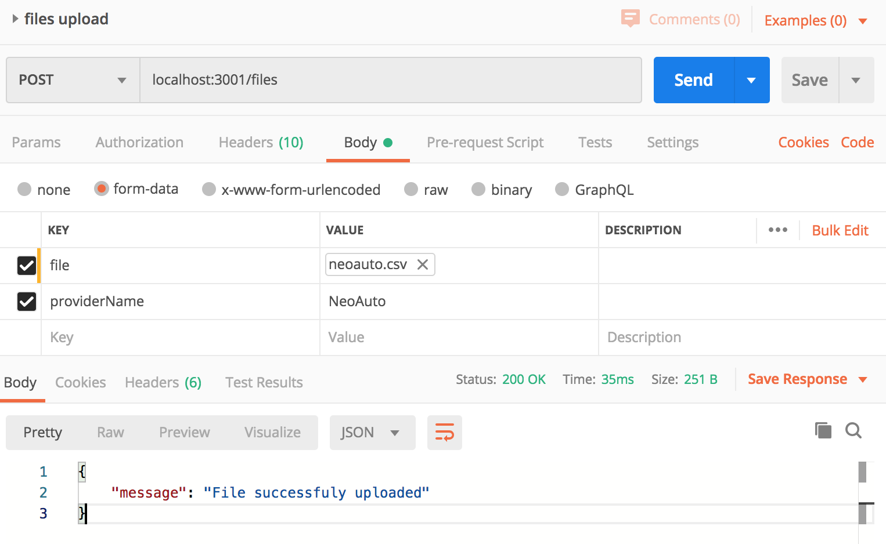

API to process a csv file and store its data into a MongoDB database.

## Install the Application

If there is a known instance of mongo db, replace the DB_URL and run:

    DB_URL=mongodb://localhost:27017 npm start

Or simply run the whole API using docker-compose

    docker-compose up --build
    
## Usage
#### Upload file

    curl --location --request POST 'localhost:3001/files' \
      --header ': ' \
      --header 'Content-Type: multipart/form-data; 
      --form 'file=@/Users/cesar/Desktop/pruebas/neoauto.csv' \
      --form 'providerName=NeoAuto'

or:

      
## Test
    npm run test

or with docker-compose:

    docker-compose exec auto-csv-parser npm run test
    
    

### Files:
`src/`: contains API source code

`tests/`: contains test used to prove app consistency. Mainly unit

`uploads/`: folder where the uploaded file will be temporarily stored

`test-data/`: contains a csv sample

`src/index.js`: bootstrap file which loads up a singleton connection to a dockerized MongoDB instance on `mongodb://mongo:27017` and starts the HTTP server

`src/server.js`: using express, creates an http server which exposes a
single POST URI to upload the files. Once the file is uploaded `fileProcessor` emits
a `fileUploaded` event in order to start the file processing

`src/fileProcessor.js`: loads all the required repositories containing the configuration layouts based on the `providerName`, the repository in charge
of storing the vehicles list and starts streaming the file to mongodb

`src/streamer.js`: reads the uploaded csv file, using `rowParser.js` parses each
row according the key map of the provider and sends the parsed row to 
`src/repositories/vehicleRepository` in order to store it

